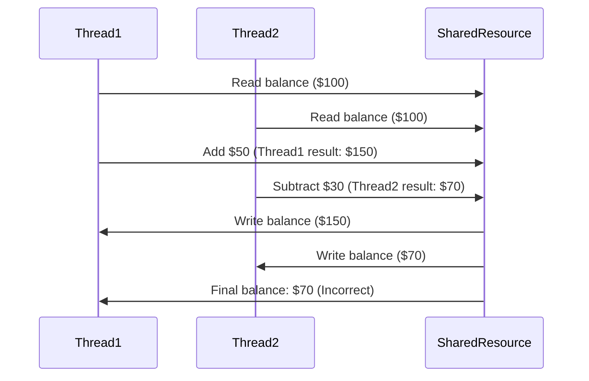
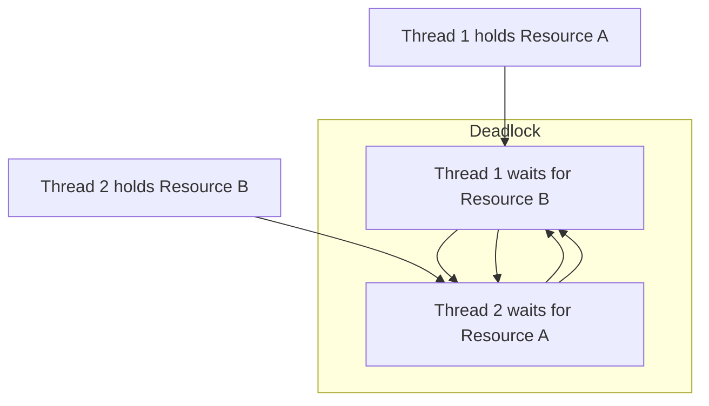
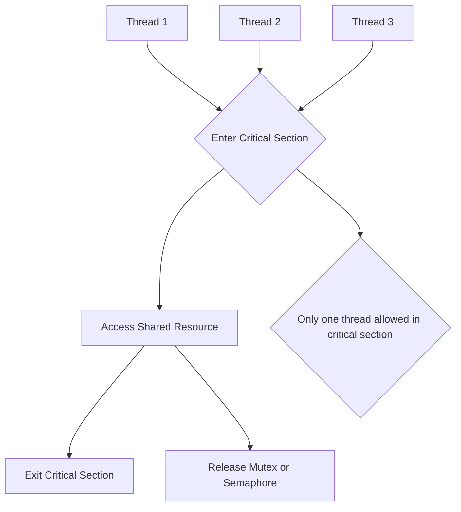
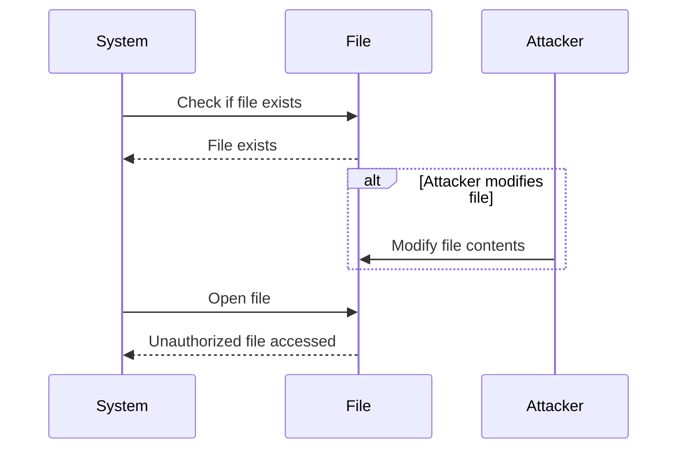
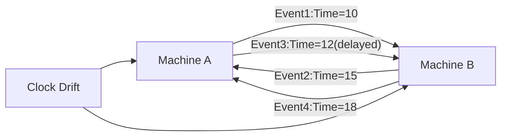
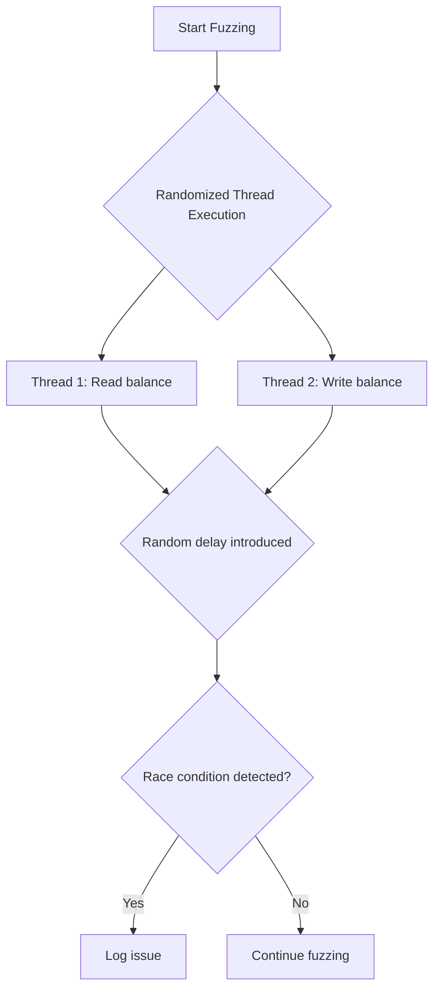

### **Mastering Concurrency: A Tester’s Guide to Uncovering Elusive Bugs**

Concurrency issues are among the most insidious bugs a software system can face. They often manifest intermittently, slipping through the cracks during testing, only to wreak havoc in production. As a tester, understanding the nature of these bugs and knowing how to effectively test for them is crucial. In this article, we’ll explore the common challenges of concurrency, how to address them through testing, as well as the tools and algorithms that can assist in detecting these issues, with added visuals to illustrate key concepts.

### **Understanding Key Concepts**

Before diving into specific techniques, it’s important to understand some fundamental terms:

#### **Race Condition**
A race condition occurs when two or more processes attempt to access shared data simultaneously without proper synchronization. This lack of control leads to unpredictable outcomes depending on the order of execution. Race conditions are difficult to detect and reproduce due to their intermittent nature.

For example, imagine two threads trying to update a bank account balance simultaneously. Without proper synchronization, both threads may read the same starting balance, perform their operations, and save their changes, resulting in incorrect balances. As testers, we need to simulate these simultaneous operations and verify that proper locking mechanisms are in place to prevent data corruption.

#### **Deadlock**
A deadlock happens when two processes are stuck waiting for each other to release resources, leading to a system-wide halt. This typically occurs in multi-threaded environments when poor resource allocation strategies are used. Detecting deadlocks requires careful attention to resource management, and as testers, we should stress-test systems with high concurrency to ensure such situations don’t occur.

For instance, if two threads each hold a resource the other needs, but neither is willing to release their own, a deadlock occurs. One approach to avoiding this issue is to impose an ordering on resource acquisition, ensuring that threads access resources in a consistent order.

#### **Critical Section**
A critical section is a part of the code where shared resources are accessed. It’s vital that no more than one thread enters a critical section at a time to avoid race conditions. Testing the robustness of these critical sections involves ensuring they are adequately protected by synchronization mechanisms like mutexes or semaphores.

#### **Synchronization Mechanisms**
Mutexes, semaphores, and locks are tools that help control access to shared resources. Proper use of these mechanisms ensures that only one thread can modify a shared resource at a time, preventing race conditions. Misuse or misunderstanding of these tools, however, can lead to issues such as deadlocks or performance degradation due to excessive locking.

**Takeaway:** As testers, it’s important to evaluate both the performance and correctness of synchronization mechanisms. Tests should verify that locks are correctly applied without causing unnecessary bottlenecks.

### **Time-based Bugs: Testing the Trickier Side of Concurrency**

#### **Timing Dependency (TOCTOU)**
One of the trickiest types of race conditions is the Time of Check to Time of Use (TOCTOU) bug. This occurs when a system checks a condition (e.g., whether a file exists), but the condition changes before the operation based on that check is executed (e.g., attempting to open the file). This time window can introduce security vulnerabilities.

#### **Heisenbug**
Heisenbugs are another class of elusive concurrency bugs that change behavior when you attempt to observe them. Often, adding logging or breakpoints alters the timing of events, making the bug disappear. As a tester, it’s important to use **minimal-invasive logging** and other low-impact monitoring techniques to avoid unintentionally masking these bugs.

**Takeaway:** Always simulate real-world delays and reduce test tool interference to improve your chances of exposing Heisenbugs.

#### **Clock Drift in Distributed Systems**
In distributed systems, different machines can experience clock drift due to slight differences in hardware or network latency. This drift can cause the sequence of events to be misinterpreted, leading to inconsistent data states. Testing in distributed systems requires special attention to **synchronization** and the use of protocols like **Lamport’s Timestamps**, which ensure a partial ordering of events in such systems.

### **The Challenge of Eventual Consistency**

In systems designed around eventual consistency, data may not be immediately consistent across nodes but will converge over time. Testing these systems requires simulating real-world scenarios, such as network partitions or delayed replication. It’s vital to ensure that all operations eventually converge, and testers must be vigilant in verifying that transient inconsistencies don’t lead to permanent errors.

**Takeaway:** Test not just for eventual consistency, but also for system behavior during the inconsistency period.

### **Asynchronous Timing Bugs and Temporal Coupling**
Asynchronous timing bugs arise when actions expected to occur in coordination fail due to different timing mechanisms. Temporal coupling, on the other hand, occurs when operations must happen in a specific order but fail to do so. To detect these issues, testers need to simulate various real-world timing scenarios, ensuring that the system can handle delays, overlaps, and out-of-order events gracefully.

### **Concurrency Testing Techniques: What Works**

To expose these bugs, concurrency testing is essential. Running multiple threads or processes simultaneously and in randomized order is one effective way to uncover race conditions. Several tools and algorithms are useful for conducting these tests.

#### **Concurrency Analyzers**
Tools like **ThreadSanitizer**, **Helgrind**, and **RaceFinder** help detect race conditions, deadlocks, and other concurrency-related issues. These tools analyze how threads interact with shared resources and help identify synchronization errors.

#### **Model Checking**
Model checking tools like **SPIN** and **TLA+** provide structured methods to formally verify concurrent systems. By modeling the system and its potential states, these tools can prove whether the system is free from deadlocks and other concurrency issues.

#### **Lock-Free and Wait-Free Algorithms**
Lock-free and wait-free algorithms are designed to avoid locks entirely, reducing the risk of deadlocks and contention. Implementing and testing systems that use these algorithms can improve performance and reduce concurrency-related bugs.

#### **Concurrency Fuzzing**
Concurrency fuzzing is a key method for discovering race conditions and timing bugs. By executing threads and processes in random or intentionally overlapping sequences, testers can increase the likelihood of exposing hidden bugs.

### **Conclusion: The Tester’s Role in Concurrency**

Concurrency bugs are complex, elusive, and require a systematic approach to uncover. As a tester, your role is to ensure that systems behave predictably under stress, concurrency, and in real-world time conditions. By focusing on proper synchronization, timing simulations, and stress-testing distributed systems, you can help eliminate the race conditions, deadlocks, and time-based bugs that lurk within. Testing concurrency is about crafting the right scenarios and using the right tools, and that’s where your expertise makes all the difference.
